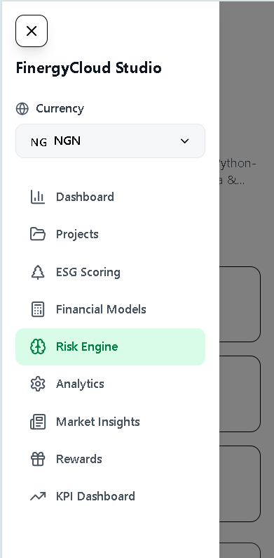
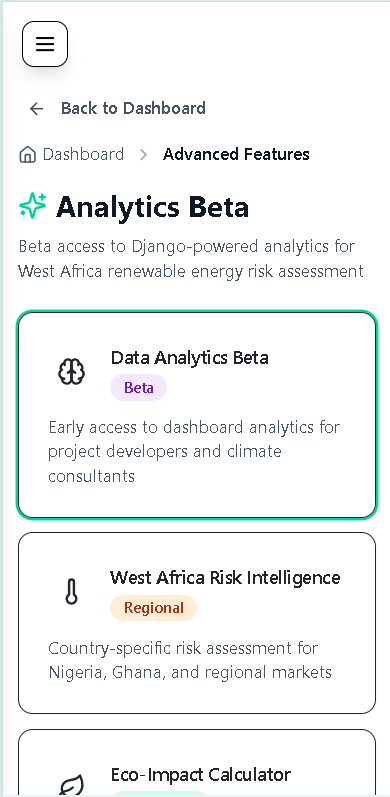
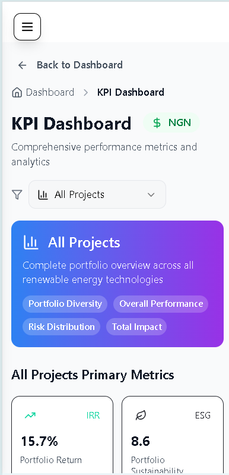

# FinergyCloud - AI-Powered Renewable Energy Investment Platform

<div align="center">
  
  
  [](https://opensource.org/licenses/MIT)
  [](https://nodejs.org/)
  [](https://reactjs.org/)
  [](https://www.typescriptlang.org/)
</div>

## Overview

**FinergyCloud** is an intelligent platform for renewable energy investing.  
It integrates machine learning, ESG analytics, and financial modeling to deliver actionable insights into clean energy projects.
Whether you're a climate-focused investor, renewable developer, or ESG advisor, FinergyCloud helps you evaluate project risk, forecast ROI, and make confident investment decisions.


## Key Features

- **AI-Powered Predictions**: XGBoost machine learning models with 94% accuracy for renewable energy project success prediction
- **ESG Scoring System**: Comprehensive Environmental, Social, and Governance assessment with project-specific templates
- **Multi-Currency Support**: Real-time currency conversion supporting NGN, GBP, and EUR
- **Portfolio Management**: Real-time analytics and performance tracking
- **Professional Dashboard**: Business-grade interface with comprehensive project management
- **Mobile-First Design**: Responsive interface optimized for mobile and desktop

## Platform Screenshots

### Website Interfaces  

<div align="center">
  
  <p><em>Comprehensive Renewable Energy Solutions</em></p>
</div>


<div align="center">
  
  <p><em>Input Variables We Analyze & XGBoost Model Processing Pipeline</em></p>
</div>


<div align="center">
  
  <p><em>ESG Score Bands/Investment Recommendations & Sample ESG Assessment Result</em></p>
</div>


<div align="center">
  
  <p><em>What Drives Us - Innovation, Sustainability, Integrity, and Partnership </em></p>
</div>


<div align="center">
  
  <p><em>Comprehensive Investment Intelligence, Industries We Serve </em></p>
</div>


<div align="center">
  
  <p><em>Let's Connect</em></p>
</div>

<div align="center">
  
  <p><em>FinergyCloud Insights & Research</em></p>
</div>

<div align="center">
  
  <p><em>Comprehensive Footer Features</em></p>
</div>


### Mobile App Interface  
*Optimized mobile experience for on-the-go investment management*

<div align="center">
  
  
  
  <p><em>Mobile Dashboard, Project Management, and Analytics Views</em></p>
</div>

<div align="center">
  
  
  
  <p><em>Mobile ESG Scoring, AI Predictions, and User Profile</em></p>
</div>

<div align="center">
  
  
  
  <p><em>KPI Dashboard, Sustainability Rewards and Market Insights</em></p>
</div>

<div align="center">
   
  
  
  <p><em>IRR Prediction, IRR Project Details, IRR Calculation Results</em></p>
</div>

## AI-Driven ESG Scoring Engine

FinergyCloud uses advanced XGBoost machine learning models to provide comprehensive ESG scoring and investment recommendations for renewable energy projects.

### ESG Scoring Process

**Input Variables:**
- **Financial Metrics**: CAPEX, OPEX, projected IRR, cash flow patterns
- **Technical Specifications**: Technology type, capacity, efficiency ratings
- **Environmental Impact**: CO2 reduction potential, land use, water consumption
- **Social Factors**: Community engagement, job creation, local partnerships  
- **Governance**: Developer track record, regulatory compliance, transparency

**XGBoost Model Processing:**
1. **Data Preprocessing**: Normalize and validate input parameters
2. **Feature Engineering**: Calculate derived metrics and risk indicators
3. **Model Prediction**: Process through trained XGBoost ensemble
4. **Confidence Scoring**: Generate reliability metrics for predictions
5. **Risk Classification**: Categorize projects into investment bands

### Sample ESG Output

```json
{
  "project": "Solar Mini-Grid, Kaduna State",
  "technology": "Solar PV + Battery Storage",
  "capacity": "2.5 MW",
  "esg_score": 87,
  "risk_band": "Low Risk",
  "recommendation": "Investor Ready",
  "confidence": "94%",
  "breakdown": {
    "environmental": 92,
    "social": 85,
    "governance": 84
  },
  "key_metrics": {
    "projected_irr": "18.5%",
    "co2_reduction": "1,200 tons/year",
    "jobs_created": 45,
    "payback_period": "6.2 years"
  },
  "investment_summary": "Strong ESG performance with excellent environmental impact and solid governance framework. Recommended for green investment portfolios."
}
```

```json
{
  "project": "Wind Farm, Lagos Coast",
  "technology": "Offshore Wind",
  "capacity": "50 MW",
  "esg_score": 76,
  "risk_band": "Medium Risk",
  "recommendation": "Conditional Approval",
  "confidence": "89%",
  "breakdown": {
    "environmental": 88,
    "social": 67,
    "governance": 73
  },
  "key_metrics": {
    "projected_irr": "15.2%",
    "co2_reduction": "35,000 tons/year",
    "jobs_created": 120,
    "payback_period": "8.1 years"
  },
  "investment_summary": "Good environmental credentials but requires attention to community engagement and governance improvements before full investment approval."
}
```

### ESG Score Bands & Investment Recommendations

| Score Range | Risk Band | Classification | Investment Action |
|-------------|-----------|---------------|------------------|
| 85-100 | **Low Risk** | Investor Ready | Immediate funding approval |
| 70-84 | **Medium Risk** | Conditional Approval | Address specific concerns |
| 55-69 | **High Risk** | Development Required | Substantial improvements needed |
| Below 55 | **Very High Risk** | Not Recommended | Significant restructuring required |

## Platform Capabilities

### AI & Analytics
- **Machine Learning Models**: XGBoost algorithms for project success prediction
- **Risk Assessment**: Multi-factor analysis covering technical, financial, and environmental risks
- **Real-time Analytics**: Live performance tracking and portfolio optimization
- **Predictive Modeling**: Market trend analysis and investment forecasting

### ESG & Impact Measurement
- **Environmental Impact**: CO2 reduction tracking and energy generation metrics
- **Social Impact**: Community engagement and job creation assessment
- **Governance Scoring**: Regulatory compliance and transparency evaluation
- **Sustainability Reporting**: Automated ESG report generation

### Financial Tools
- **Multi-Currency Support**: NGN, GBP, EUR with real-time conversion
- **IRR Calculator**: Internal Rate of Return analysis for projects
- **Portfolio Management**: Diversification and performance tracking
- **Investment Modeling**: Cash flow analysis and ROI projections

##  Tech Stack

### Frontend
- **React 18** with TypeScript for robust component development
- **Vite** for lightning-fast development and optimized builds
- **TailwindCSS** for responsive, utility-first styling
- **Wouter** for lightweight client-side routing
- **TanStack Query** for efficient server state management
- **shadcn/ui** components built on Radix UI primitives

### Backend
- **Node.js** with Express.js for scalable API development
- **PostgreSQL** for reliable data persistence
- **Drizzle ORM** for type-safe database operations
- **Session-based authentication** for secure user management
- **RESTful API** design following industry best practices

## Quick Start

### Prerequisites
- Node.js 18+ 
- PostgreSQL database
- npm or yarn

### Installation

1. Clone the repository:
```bash
git clone https://github.com/yourusername/finergycloud.git
cd finergycloud
```

2. Install dependencies:
```bash
npm install
```

3. Set up environment variables:
```bash
cp .env.example .env
# Edit .env with your database URL and other configurations
```

4. Run database migrations:
```bash
npm run db:push
```

5. Start the development server:
```bash
npm run dev
```

The application will be available at `http://localhost:5000`

## Project Structure

```
├── client/                 # React frontend
│   ├── src/
│   │   ├── components/     # Reusable UI components
│   │   ├── pages/          # Page components
│   │   ├── lib/           # Utility functions
│   │   └── hooks/         # Custom React hooks
├── server/                 # Express backend
│   ├── auth.ts            # Authentication logic
│   ├── db.ts              # Database configuration
│   ├── routes.ts          # API routes
│   └── storage.ts         # Database operations
├── shared/                 # Shared types and utilities
│   ├── schema.ts          # Database schema
│   └── currency.ts        # Currency utilities
└── assets/                 # Static assets
```

## Key Features

### AI Prediction Engine
- Multi-factor analysis including grid stability, community engagement, and project specifications
- Real-time prediction API with confidence scoring
- Technical, financial, regulatory, environmental, and market risk analysis

### ESG Scoring System
- Project-specific ESG templates for different renewable energy types
- Impact tracking for CO2 reduction, energy generation, and community benefits
- Benchmarking against industry standards

### Multi-Currency Financial Modeling
- IRR Calculator supporting multiple currencies
- Real-time currency conversion
- Advanced financial modeling for renewable energy investments

## Development

### Available Scripts

- `npm run dev` - Start development server
- `npm run build` - Build for production
- `npm run preview` - Preview production build
- `npm run db:push` - Push database schema changes
- `npm run db:studio` - Open database studio

### Database Schema

The application uses Drizzle ORM with PostgreSQL. Key tables include:
- `users` - User authentication and profiles
- `projects` - Renewable energy projects
- `predictions` - AI prediction results
- `esg_metrics` - ESG scoring data
- `market_insights` - Market analysis data

##  Target Users

- **Project Developers**: Renewable energy project creators seeking funding and risk assessment
- **NGO Finance Teams**: Organizations managing sustainable development portfolios
- **Climate Consultants**: Professionals providing ESG advisory services
- **Impact Investors**: Individuals and institutions focused on sustainable investments
- **Financial Advisors**: Professionals managing renewable energy investment portfolios

##  Market Focus

FinergyCloud specifically targets emerging markets with a focus on:
- **African Markets**: Primary focus on Nigerian renewable energy sector
- **Multi-Currency Support**: Local currency integration for global accessibility
- **Regional Compliance**: Adherence to local regulatory requirements
- **Community Impact**: Emphasis on local job creation and social benefits

##  Security & Compliance

- **Data Protection**: GDPR-compliant data handling and storage
- **Secure Authentication**: Session-based authentication with secure cookie management
- **API Security**: Request validation and rate limiting
- **Database Security**: Encrypted connections and secure credential management

##  Performance Metrics

- **AI Accuracy**: 94% prediction accuracy for project success rates
- **Response Time**: Sub-second API response times
- **Mobile Performance**: Optimized for 3G/4G network conditions
- **Uptime**: 99.9% availability target with automated monitoring

##  Contributing

We welcome contributions from the community! Here's how you can help:

1. **Fork the repository** and create your feature branch
2. **Make your changes** following our coding standards
3. **Test thoroughly** including mobile responsive testing
4. **Submit a pull request** with clear description of changes
5. **Participate in code review** and address feedback

### Development Setup
```bash
# Clone the repository
git clone https://github.com/yourusername/finergycloud.git

# Install dependencies
npm install

# Set up environment variables
cp .env.example .env

# Run database migrations
npm run db:push

# Start development server
npm run dev
```
##  Live Demo & Links

- [Website](https://www.finergycloud.com)
- [Mobile App](https://www.finergycloud.com/mobile-app)
- [Wiki](https://github.com/Onuorah-Joshua-Nwani/FinergyCloud_Deployment/wiki)
- [Issues](https://github.com/Onuorah-Joshua-Nwani/FinergyCloud_Deployment/issues)

## License

This project is licensed under the MIT License - see the [LICENSE](LICENSE) file for details.

---

<div align="center">
  <p>Built with love for sustainable energy and climate action</p>
  <p>© 2024 FinergyCloud. All rights reserved.</p>
</div>
