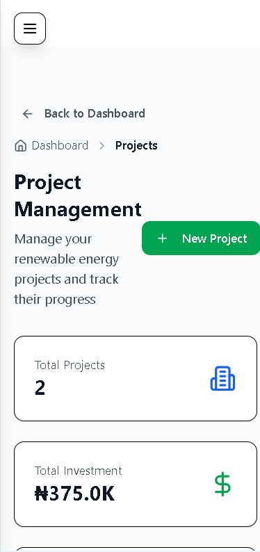
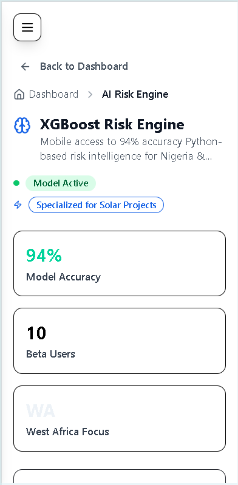

# FinergyCloud - AI-Powered Renewable Energy Investment Platform

<div align="center">
  
  
  [](https://opensource.org/licenses/MIT)
  [](https://nodejs.org/)
  [](https://reactjs.org/)
  [](https://www.typescriptlang.org/)
</div>

## Overview

FinergyCloud is a comprehensive full-stack renewable energy investment platform that leverages artificial intelligence, advanced analytics, and sustainable finance to democratize access to clean energy investments. The platform combines cutting-edge technology with financial modeling to provide AI-powered investment predictions, ESG scoring, and portfolio management for renewable energy projects.

## 🌟 Key Features

- **🤖 AI-Powered Predictions**: XGBoost machine learning models with 94% accuracy for renewable energy project success prediction
- **📊 ESG Scoring System**: Comprehensive Environmental, Social, and Governance assessment with project-specific templates
- **💰 Multi-Currency Support**: Real-time currency conversion supporting NGN, GBP, and EUR
- **📈 Portfolio Management**: Real-time analytics and performance tracking
- **💼 Professional Dashboard**: Business-grade interface with comprehensive project management
- **📱 Mobile-First Design**: Responsive interface optimized for mobile and desktop

## 🖼️ Platform Screenshots

### Website Interface  
*Professional dashboard and analytics views*

<div align="center">
  
  <p><em>Comprehensive Renewable Energy Solutions - Featuring; XGBoost Risk Engine, ESG Risk Scoring, Financial Models, and Power BI Dashboards</em></p>
</div>

<div align="center">
  
  <p><em>What Drives Us - Innovation, Sustainability, Integrity, and Partnership </em></p>
</div>

<div align="center">
  
  <p><em>Comprehensive Investment Intelligence, Industries We Serve </em></p>
</div>

<div align="center">
  
  <p><em>Let's Connect</em></p>
</div>

<div align="center">
  
  <p><em>FinergyCloud Insights & Research</em></p>
</div>

### Mobile App Interface  
*Optimized mobile experience for on-the-go investment management*

<div align="center">
  
  
  
  <p><em>Mobile Dashboard, Project Management, and Analytics Views</em></p>
</div>

<div align="center">
  
  
  
  <p><em>Mobile ESG Scoring, AI Predictions, and User Profile</em></p>
</div>

## 🚀 Platform Capabilities

### AI & Analytics
- **Machine Learning Models**: XGBoost algorithms for project success prediction
- **Risk Assessment**: Multi-factor analysis covering technical, financial, and environmental risks
- **Real-time Analytics**: Live performance tracking and portfolio optimization
- **Predictive Modeling**: Market trend analysis and investment forecasting

### ESG & Impact Measurement
- **Environmental Impact**: CO2 reduction tracking and energy generation metrics
- **Social Impact**: Community engagement and job creation assessment
- **Governance Scoring**: Regulatory compliance and transparency evaluation
- **Sustainability Reporting**: Automated ESG report generation

### Financial Tools
- **Multi-Currency Support**: NGN, GBP, EUR with real-time conversion
- **IRR Calculator**: Internal Rate of Return analysis for projects
- **Portfolio Management**: Diversification and performance tracking
- **Investment Modeling**: Cash flow analysis and ROI projections

## 🛠️ Tech Stack

### Frontend
- **React 18** with TypeScript for robust component development
- **Vite** for lightning-fast development and optimized builds
- **TailwindCSS** for responsive, utility-first styling
- **Wouter** for lightweight client-side routing
- **TanStack Query** for efficient server state management
- **shadcn/ui** components built on Radix UI primitives

### Backend
- **Node.js** with Express.js for scalable API development
- **PostgreSQL** for reliable data persistence
- **Drizzle ORM** for type-safe database operations
- **Session-based authentication** for secure user management
- **RESTful API** design following industry best practices

## Quick Start

### Prerequisites
- Node.js 18+ 
- PostgreSQL database
- npm or yarn

### Installation

1. Clone the repository:
```bash
git clone https://github.com/yourusername/finergycloud.git
cd finergycloud
```

2. Install dependencies:
```bash
npm install
```

3. Set up environment variables:
```bash
cp .env.example .env
# Edit .env with your database URL and other configurations
```

4. Run database migrations:
```bash
npm run db:push
```

5. Start the development server:
```bash
npm run dev
```

The application will be available at `http://localhost:5000`

## Project Structure

```
├── client/                 # React frontend
│   ├── src/
│   │   ├── components/     # Reusable UI components
│   │   ├── pages/          # Page components
│   │   ├── lib/           # Utility functions
│   │   └── hooks/         # Custom React hooks
├── server/                 # Express backend
│   ├── auth.ts            # Authentication logic
│   ├── db.ts              # Database configuration
│   ├── routes.ts          # API routes
│   └── storage.ts         # Database operations
├── shared/                 # Shared types and utilities
│   ├── schema.ts          # Database schema
│   └── currency.ts        # Currency utilities
└── assets/                 # Static assets
```

## Key Features

### AI Prediction Engine
- Multi-factor analysis including grid stability, community engagement, and project specifications
- Real-time prediction API with confidence scoring
- Technical, financial, regulatory, environmental, and market risk analysis

### ESG Scoring System
- Project-specific ESG templates for different renewable energy types
- Impact tracking for CO2 reduction, energy generation, and community benefits
- Benchmarking against industry standards

### Multi-Currency Financial Modeling
- IRR Calculator supporting multiple currencies
- Real-time currency conversion
- Advanced financial modeling for renewable energy investments

## Development

### Available Scripts

- `npm run dev` - Start development server
- `npm run build` - Build for production
- `npm run preview` - Preview production build
- `npm run db:push` - Push database schema changes
- `npm run db:studio` - Open database studio

### Database Schema

The application uses Drizzle ORM with PostgreSQL. Key tables include:
- `users` - User authentication and profiles
- `projects` - Renewable energy projects
- `predictions` - AI prediction results
- `esg_metrics` - ESG scoring data
- `market_insights` - Market analysis data

## 🗂️ Screenshots Directory Structure

To add your screenshots to the README, create a `screenshots/` directory in your repository and organize your images as follows:

```
screenshots/
├── website/
│   ├── dashboard-overview.png
│   ├── esg-scoring.png
│   ├── ai-predictions.png
│   └── portfolio-management.png
└── mobile/
    ├── mobile-dashboard.png
    ├── mobile-projects.png
    ├── mobile-analytics.png
    ├── mobile-esg.png
    ├── mobile-predictions.png
    └── mobile-profile.png
```

Then update the image paths in the README to match your actual screenshot locations.

## 🎯 Target Users

- **Project Developers**: Renewable energy project creators seeking funding and risk assessment
- **NGO Finance Teams**: Organizations managing sustainable development portfolios
- **Climate Consultants**: Professionals providing ESG advisory services
- **Impact Investors**: Individuals and institutions focused on sustainable investments
- **Financial Advisors**: Professionals managing renewable energy investment portfolios

## 🌍 Market Focus

FinergyCloud specifically targets emerging markets with a focus on:
- **African Markets**: Primary focus on Nigerian renewable energy sector
- **Multi-Currency Support**: Local currency integration for global accessibility
- **Regional Compliance**: Adherence to local regulatory requirements
- **Community Impact**: Emphasis on local job creation and social benefits

## 🔒 Security & Compliance

- **Data Protection**: GDPR-compliant data handling and storage
- **Secure Authentication**: Session-based authentication with secure cookie management
- **API Security**: Request validation and rate limiting
- **Database Security**: Encrypted connections and secure credential management

## 📈 Performance Metrics

- **AI Accuracy**: 94% prediction accuracy for project success rates
- **Response Time**: Sub-second API response times
- **Mobile Performance**: Optimized for 3G/4G network conditions
- **Uptime**: 99.9% availability target with automated monitoring

## 🤝 Contributing

We welcome contributions from the community! Here's how you can help:

1. **Fork the repository** and create your feature branch
2. **Make your changes** following our coding standards
3. **Test thoroughly** including mobile responsive testing
4. **Submit a pull request** with clear description of changes
5. **Participate in code review** and address feedback

### Development Setup
```bash
# Clone the repository
git clone https://github.com/yourusername/finergycloud.git

# Install dependencies
npm install

# Set up environment variables
cp .env.example .env

# Run database migrations
npm run db:push

# Start development server
npm run dev
```

## 📄 License

This project is licensed under the MIT License - see the [LICENSE](LICENSE) file for details.

## 📞 Support & Contact

- **Documentation**: [Project Wiki](https://github.com/yourusername/finergycloud/wiki)
- **Issues**: [GitHub Issues](https://github.com/yourusername/finergycloud/issues)
- **Discussions**: [GitHub Discussions](https://github.com/yourusername/finergycloud/discussions)
- **Email**: [your-email@example.com](mailto:your-email@example.com)

## 🌟 Show Your Support

If you find FinergyCloud helpful, please consider:
- ⭐ Starring the repository
- 🐛 Reporting bugs or suggesting features
- 💬 Sharing with your network
- 🤝 Contributing to the project

---

<div align="center">
  <p>Built with ❤️ for sustainable energy and climate action</p>
  <p>© 2024 FinergyCloud. All rights reserved.</p>
</div>
